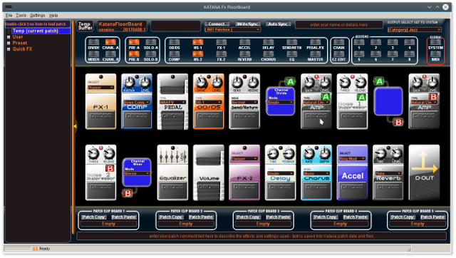
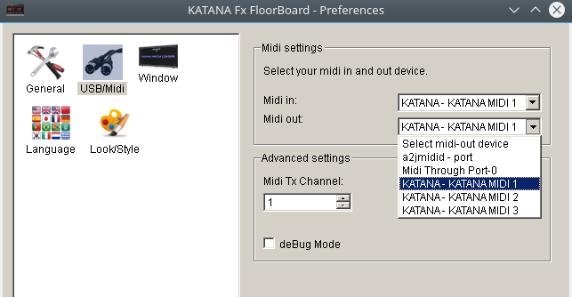
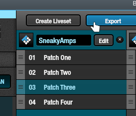
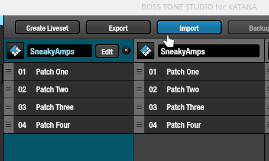

# How To: use 27 amp types.

**Tested on:** 
✓ Firmware `1.0.2` 
✓ Katana-100 Combo 

#### Contents

<!-- TOC depthFrom:2 depthTo:3 withLinks:1 updateOnSave:1 orderedList:0 -->

- [Introduction](#introduction)
- [3rd party software method](#3rd-party-software-method)
	- [KATANAFxFloorBoard](#katanafxfloorboard)
	- [Katana Editor for Android](#katana-editor-for-android)
- [Tone Studio and `.tsl` files method](#tone-studio-and-tsl-files-method)
- [SysEx MIDI messages method](#sysex-midi-messages-method)

<!-- /TOC -->

## Introduction

The Boss Katana amp, at the time of writing contains 27 amp types, of which only 5 are made available by default. These 27 amps appear to be the same as the Boss GT-100 pre-amps.

There's a few ways to select what I like to call **Sneaky Amps** and use them in your patches.

**Heads up!**
Different amp types have different output volumes, even with the same GAIN & VOLUME settings. Test out new settings at a lower MASTER volume to avoid sudden loud noises.

## 3rd party software method

3rd party software is still in the works. But the first experimental software is out there.
[Submit an issue](https://github.com/katana-dev/docs/issues/new) if you know of software doing this that isn't listed yet.

### KATANAFxFloorBoard

By Colin Willcocks (gumtownbassman@yahoo.com).
The first application that allows setting all 27 Sneaky Amps since version `20170408.1`.

Windows download is available here: https://sourceforge.net/projects/fxfloorboard/files/experimental/
Which also works on Linux with Wine 2.1.

**Connect your KATANA**

At the time of writing, the application does not detect devices *after* starting the application.
So make sure your KATANA is on and connected.

**Install and open the application**

You should get a full floorboard like this when done installing.

**Select MIDI channel**

Go to Settings > Preferences (Ctrl + P).
You want to *at least* select `Midi out` here to be:

- For Windows use `KATANA` (not the DAW CTRL or CTRL ones).
- For Linux use `KATANA - KATANA 1` (not 2 or 3).

(Setting `Midi in` to be the same one may become relevant in future versions)

**Change the right amp!**

On the floorboard, locate the *correct* Sneaky Amp stompbox.

 &lArr; The **AMP** pedal that has a **green A** on it.

There will also be a red B one, this isn't the one you want.

**Lower master volume**

This is where you want to lower the MASTER volume on your Katana if you haven't done so yet.
Changing amp types **will** change the output volume. Test out new settings at a lower MASTER volume to avoid sudden loud noises.

**Select a Sneaky Amp type**

Click the type dropdown menu.
As soon as you hover over a different amp type your Katana should switch to it **right away**. This will take around a second to do every time so try not to move too fast, or you could select the wrong amp.

 For more info on each amp, check the [Amp Type table](../tables/amp-types.md).

**After this**

Once you've set the Sneaky Amp type you like, don't move the Amp type knob on your Katana or Tone Studio. This will of course change your amp type back to one of the defaults.

Saving your Sneaky Amp to a TONE SETTING (CH1-4) **does work**. And you can use Tone Studio to import/export your tone, including Sneaky Amp.

**Experimental release**

Keep in mind this is an experimental release. Changing other settings may not work as intended.

### Katana Editor for Android

By condor from VGuitarForums.
Available as a zip attachment there: http://www.vguitarforums.com/smf/index.php?topic=20234.msg147575#msg147575
Look for "KatanaEditor8.zip" it's easy to overlook the download.

Note: the developer mentioned they will add an easier way to choose Sneaky Amps soon&trade;.
In future versions this may be as easy as selecting the Sneaky Amp from a list.

**Installing**

Extract the .apk file from the zip. Transfer this file to your Android and install it.
For example by using a file manager app.

wikiHow has a guide to help with this step. http://www.wikihow.tech/Manually-Install-Android-Apps

**Connecting**

You will need a USB On-The-Go (OTG) cable.
With that, connect your Android directly to the Katana's USB port.

Your phone will ask you, which app to open this USB device with.
Select KatanaEditor and give it any required permissions when asked.

At first all settings may show up incorrect. This is a known issue with the current version.
Try to move some knobs on your Katana as well as sliders on the app until the app syncs and accurately shows what your amp settings are.

**Sending a SysEx message**

Use the menu (top right) and select "Show Test Screen".
At the bottom you will find some inputs.

The **address** you should enter is `60 00 00 51`.

The **value** is the SysEx number for the Sneaky Amp you want, without the `0x` in front.
Take a look at the [Amp Type table](../tables/amp-types.md) and pick a Sneaky Amp.

For example:

TSL | SysEx | GT-100 Name | Katana LED
:-:|:-:|-:|:-
27 | 0x1B | ORNG RB | Brown

The correct value for the ORNG RB is `1B`.

Address `60 00 00 51` for Sneaky Amps, value `1B` for ORNG RB.

**That's it**

Press SendTx and your Katana should switch to the ORNG RB right away.

## Tone Studio and `.tsl` files method

The `.tsl` files are JSON formatted livesets you can in/export in Boss Tone Studio for Katana. By editing these files, you are able to choose any of the 27 amp types.

**Export the Liveset you want to edit.**

Note the position of the patch you want to edit. In our case it's the 3rd one.

**Open the file in a text editor**

Search for `"preamp_a_type"`, it should have the same number of matches as there are patches in this liveset. Cycle through them until you find the one you want to edit. In our case the 3rd.

**Replace the number using the table**

Use the [Amp Type table](../tables/amp-types.md) to find the Sneaky Amp you want to use.

For example, perhaps you want the DELUXE CRUNCH. In the table this is listed as:

TSL | SysEx | GT-100 Name | Katana LED
:-:|:-:|-:|:-
12 | 0x0C | DELUXE CRUNCH | Crunch

The TSL number 12 is the one you want to use.

**Save, import and drag**

Importing your edited file will create a new entry in your librarian. The left one will be your edited version. Drag the edited patch "Patch Three" to any of your preset. For example CH3.

Now whenever you select CH3 it should load your patch with the DELUXE CRUNCH amp.
And as the table indicates, the LED should light up at Crunch.

**Validating**

How do you know it's for real though?

Play some notes with your guitar on this setting. You will notice it's quite low-gain.

Now move the AMP TYPE knob to something else (CLEAN for example) and back to CRUNCH. This should revert the amp type back to the default (TWEED) which is much higher gain.

Switch between CH1 and CH3 so it loads your saved CH3. You will be back on the DELUXE CRUNCH.

## SysEx MIDI messages method

This is a more advanced method, aimed at 3rd party software developers and knowledgeable hackers.

In this [Reverse Engineered SysEx specification by Steven Hirsch](https://github.com/snhirsch/katana-midi-bridge/blob/master/doc/katana_sysex.txt) you can find how to construct SysEx MIDI messages for the Katanas, along with python code that does so.

There are two addresses associated with the amp type you can write to over SysEx. Either address immediately switches the amp type of whichever TONE SETTING you are currently on (CH1-4 or PANEL).

#### Default Amps `0x00 0x00 0x04 0x20`

This is what Tone Studio uses to write to and corresponds to the knob on your amp.

It's values are: 
`0x00` Acoustic 
`0x01` Clean 
`0x02` Crunch 
`0x03` Lead 
`0x04` Brown 

#### Sneaky Amps `0x60 0x00 0x00 0x51`

This is the address that takes the GT-100's values for pre-amps.
It's values are between `0x00` and `0x1B`.
You can find the full list in the SysEx column of the [Amp Type table](../tables/amp-types.md).
